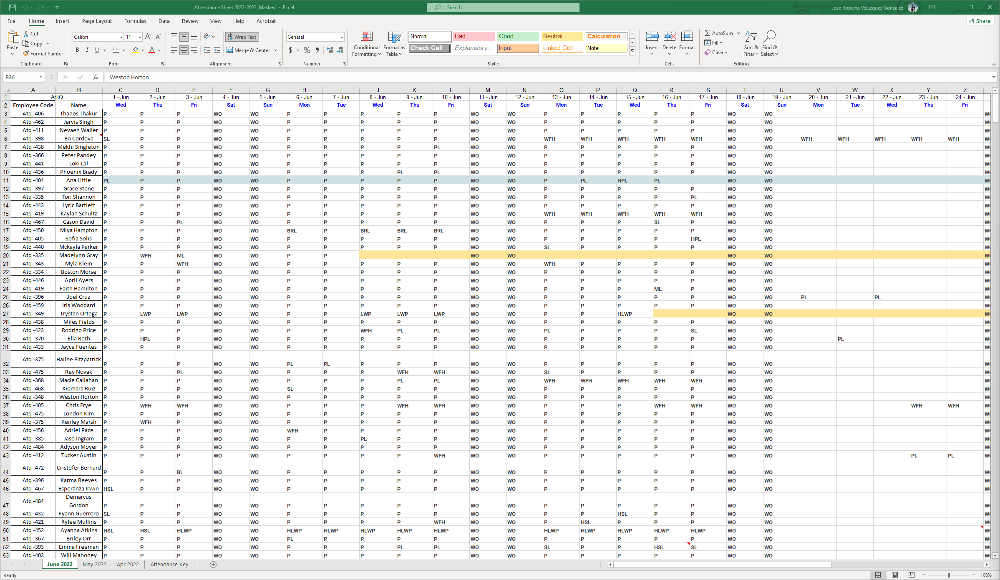
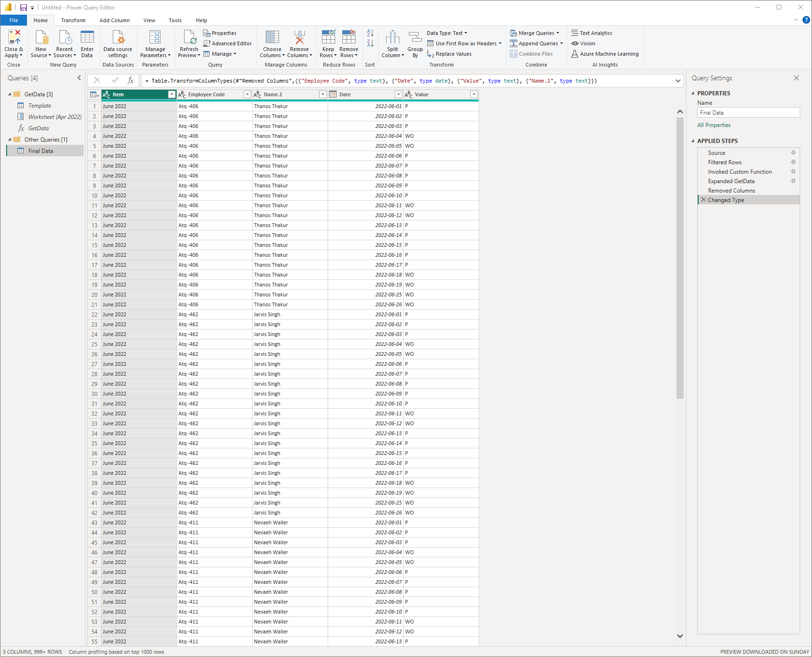

# HR Attendance Analytics

## Introduction and Problem Statement

*  Received 3 months of randomized employee attendance data from AtliQ Technologies
*  Goal is to perform EDA and create interactive dashboards to uncover insights
*  Will demonstrate end-to-end analytics lifecycle on this real-world dataset

## Understanding HR Requirements

*  Engaged end user Pinali to understand key questions around attendance, remote work, sick leaves
*  Discussed requirements for scheduling, office space optimization, health outbreak prevention
*  Ensured solution is tailored, sustainable and enables independent analysis

## Gathering and Transforming Data

*  Used Power Query to import, append sheets, standardize columns, clean data
*  Parameterized code for reusability, designed automated pipeline from Excel to analytics-ready structures

## Creating Metrics Using DAX

*  Built KPIs like Present Days, Total Working Days, Presence Percentage using DAX calculations
*  Modularized measures for reusability across visualizations and dashboards

## Dashboarding in Power BI

*  Created interactive dashboards with trends, drill-downs and context on metrics
*  Dashboards enabled self-service insights on attendance patterns and outliers
*  Gathered feedback from Pinali on potential dashboard enhancements
*  Download the PowerBI dashboard [here](HRDashboard.pbix)

In summary, followed a structured analytics lifecycle to gather data, understand user needs, transform data, calculate metrics and create insights through dashboards. Demonstrated range of technical and analytics skills.

This project is guided project by the YouTube video ["End to End Data Analysis Project | HR Analytics Power BI Project"](https://www.youtube.com/watch?v=JC66t9eM10s) by codebasics. All files available for download in the video description.
